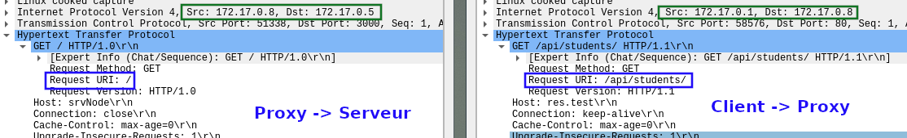

## Load Balancer

Dans cette étape nous allons mettre en place un load balancer du type round-robin. Un load balancer change pour chaque requête le serveur qui traite la requête.

Pour cela nous utilisons les serveur NGINX.  Voilà le Dockerfile pour ce conteneur:

```dockerfile
FROM nginx
COPY default.conf /etc/nginx/conf.d/default.conf
```

Le fichier de configuration est le suivant:

```nginx
log_format balancerlog '$server_name: [$request] to: $upstream_addr ';
upstream srv {
    server 172.17.0.2;
    server 172.17.0.3;
    server 172.17.0.4;
}
upstream srvNode {
    server 172.17.0.5:3000;
    server 172.17.0.6:3000;
    server 172.17.0.7:3000;
}
server {
    listen       80;
    server_name  res.test;
    access_log  /var/log/nginx/access.log balancerlog;
    location ^~ /api/students/ {
        rewrite ^/api/students/ /? break;
        proxy_pass http://srvNode;
    }
    location / {
        proxy_pass http://srv;
        proxy_http_version 1.1;
        proxy_set_header HOST $host;
        proxy_set_header X-Forwarded-Host $server_name;
        proxy_set_header X-Forwarded-For $proxy_add_x_forwarded_for;
        proxy_set_header X-Real-IP $remote_addr;
        proxy_set_header Upgrade $http_upgrade;
        proxy_set_header Conncetion "upgrade";
    }
}
```

Les serveurs apache qui peuvent répondre aux requêtes http (`/`) sont listé dans l'objet srv.

Les serveurs espressif qui peuvent répondre aux requêtes http (`api/students`) sont listé dans l'objet srvNode. Pour ces requetes on doit rewrite la requete pour enlever de l'url la partie `api/students`.

**Makefile**

Pour cette étape nous avons décider d'utiliser un Makefile pour démarrer tous les conteneur en même temps. Nous utilisons le Makefile aussi pour modifier les adresses IP des serveurs dans le fichier de configuration du NGINX. 

```BAsh
.PHONY: up
up:
	./run.sh
down:
	docker kill apache1
	docker kill apache2
	docker kill apache3
	docker rm apache1
	docker rm apache2
	docker rm apache3
	docker kill express1
	docker kill express2
	docker kill express3
	docker rm express1
	docker rm express2
	docker rm express3
	docker kill nginx
	docker rm nginx
```

Script run.sh:

```bash
	#démarrer les serveurs web
	docker run -d --name apache1 res/apache
	docker run -d --name apache2 res/apache
	docker run -d --name apache3 res/apache
    docker run -d --name express1 res/express
	docker run -d --name express2 res/express
	docker run -d --name express3 res/express
	
	# modifier le fichier de config NGINX
	sed 's/srv1/'$(docker inspect apache1 | grep -i ipaddr | tail -1 | cut -d'"' -f4)'/g' nginx-image/default.conf.template > nginx-image/default.conf
	sed -i 's/srv2/'$(docker inspect apache2 | grep -i ipaddr | tail -1 | cut -d'"' -f4)'/g' nginx-image/default.conf
	sed -i 's/srv3/'$(docker inspect apache3 | grep -i ipaddr | tail -1 | cut -d'"' -f4)'/g' nginx-image/default.conf

  sed -i 's/srvnode1/'$(docker inspect express1 | grep -i ipaddr | tail -1 | cut -d'"' -f4)'/g' nginx-image/default.conf
	sed -i 's/srvnode2/'$(docker inspect express2 | grep -i ipaddr | tail -1 | cut -d'"' -f4)'/g' nginx-image/default.conf
	sed -i 's/srvnode3/'$(docker inspect express3 | grep -i ipaddr | tail -1 | cut -d'"' -f4)'/g' nginx-image/default.conf

  echo '======='
  cat nginx-image/default.conf
  echo '======='

	# Rebuild l'image NGINX avec la nouvelle config
	docker build --tag res/nginx nginx-image/
	#Démarrer le serveur NGINX
	docker run -d --name nginx res/nginx

	echo 'nginx server adress :'
  docker inspect nginx | grep -i ipaddr | tail -1 | cut -d'"' -f4
```

##### Tests

Pour tester notre configuration on actualise plusieurs fois la page web et on analyse les fichiers logs de NGINX:

```BASH
[deni@silet docker-images]$ docker logs nginx
res.test: [GET / HTTP/1.1] to: 172.17.0.2:80 
res.test: [GET / HTTP/1.1] to: 172.17.0.4:80 
res.test: [GET / HTTP/1.1] to: 172.17.0.3:80 
res.test: [GET / HTTP/1.1] to: 172.17.0.2:80 
res.test: [GET /api/students/ HTTP/1.1] to: 172.17.0.5:3000 
res.test: [GET /api/students/ HTTP/1.1] to: 172.17.0.6:3000 
res.test: [GET /api/students/ HTTP/1.1] to: 172.17.0.7:3000 
res.test: [GET /api/students/ HTTP/1.1] to: 172.17.0.5:3000 
res.test: [GET /api/students/ HTTP/1.1] to: 172.17.0.6:3000 
res.test: [GET /api/students/ HTTP/1.1] to: 172.17.0.7:3000
```

On voit que NGINX fait bien un round robin entre les 3 serveur Apache pour les requêtes GET sur `/`. On voit qu'il fait aussi de la redirection vers les 3 serveurs expressif.

**Analyse wireshark**


On voit que le serveur NGINX (172.17.0.5) transmet les requêtes vers les trois serveurs.7




Pour le serveur expressif on voit que NGINX modifie la Request URI. 


